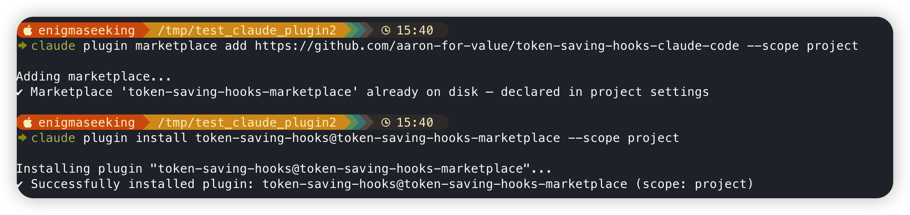
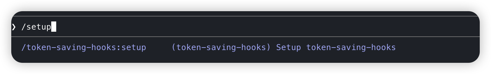
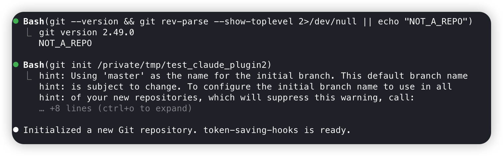

# token-saving-hooks

A Claude Code plugin that reduces token consumption through automated hooks:

| Hook | Trigger | Effect |
|---|---|---|
| Read dedup | Read same file twice in a session | Blocks re-read if content unchanged |
| Bash diff guard | `git diff` without compression | Blocks and requires piping through `compress-diff.sh` |
| Bash dedup | Identical bash command repeated | Blocks duplicate execution |
| Context snapshot | `/compact` (PreCompact) | Saves context snapshot before compaction |
| Session restore | Session start | Restores snapshot if one exists |
| Quality gate | Session stop | Checks last test output for failures |
| Ctx auto-compact | User message when ctx ≥ 55% | Blocks message, prompts user to `/compact` first |

---

## Installation — Claude Code

**Requirements:** Claude Code v2.1.92+, Git installed on your machine.

Project-level installation is recommended — the plugin config is stored in `.claude/settings.json` and shared with your team automatically when they clone the repo.

### Step 1 & 2: Add marketplace and install plugin

Run the following in your **terminal** from the project directory (not inside Claude Code):

```bash
claude plugin marketplace add https://github.com/aaron-for-value/token-saving-hooks-claude-code --scope project
claude plugin install token-saving-hooks@token-saving-hooks-marketplace --scope project
```



### Step 3: Reload plugins

Run inside **Claude Code**:

```
/reload-plugins
```

### Step 4: Setup (first time per project)

Run inside **Claude Code**:

```
/setup
```

This checks that Git is available and initializes a repo if needed. It also stages existing non-hidden files so `git diff` has a baseline to work with.





### Optional: Status line

Add to `.claude/settings.json` (project) or `~/.claude/settings.json` (global):

```json
"statusLine": {
  "type": "command",
  "command": "bash ${CLAUDE_PLUGIN_ROOT}/statusline/statusline.sh"
}
```

### Using compress-diff

When Claude runs `git diff`, it will be blocked unless piped through the compression script:

```bash
git diff | bash "${CLAUDE_PLUGIN_ROOT}/scripts/compress-diff.sh"
```

---

## Known limitations

- **Windows**: hooks are bash + Python scripts. Native Windows (no WSL) is not supported.
- **Codex**: see [Codex installation](#installation--codex) below (coming soon).
- **Bash diff guard — escaped quotes**: The guard strips `"..."` and `'...'` content before scanning for `git diff`, so commit messages containing `git diff` no longer trigger false positives. However, escaped quotes inside strings (e.g. `git commit -m "fix \"git diff\" output"`) are not handled — the inner escaped quote will not be stripped and may still cause a false positive.
